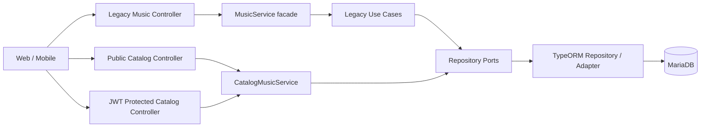
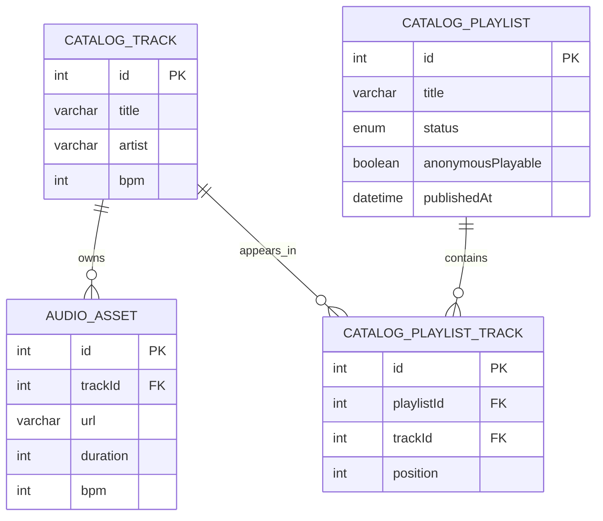
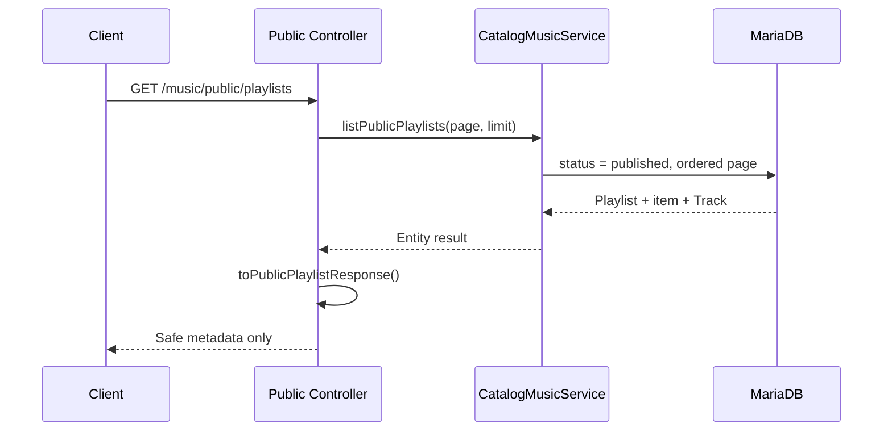

# Music 설계 및 아키텍처

## 1. 현재 아키텍처

Catalog와 Legacy는 현재 같은 도메인 이름을 사용하지만 물리적으로 분리되어 있습니다.

## 2. 데이터 모델

`playlist_track`는 `(playlistId, position)` unique index를 갖습니다. Playlist 안에서 순서가 하나만 존재해야 하기 때문입니다. Playlist 삭제는 관계 행을 cascade 삭제하고, Catalog Track 삭제는 Playlist 관계를 보호하도록 `RESTRICT`를 사용합니다.

## 3. API 경계

| API | 인증 | 목적 | 공개 응답 |
| --- | --- | --- | --- |
| `GET /music/public/playlists` | 없음 | published Playlist 목록 | 메타데이터와 Track 수 |
| `GET /music/public/playlists/:id` | 없음 | published Playlist 상세 | Track 요약과 position |
| `GET /music/tracks` | 없음 | Catalog Track 목록 | 제목, artist, BPM |
| `GET /music/tracks/:id` | 없음 | Catalog Track 상세 | 음원 URL 제외 |
| `POST /music/playlists` | JWT | Playlist 생성 | 관리 응답 |
| `PATCH /music/playlists/:id/publish` | JWT | 공개 전환 | 관리 응답 |
| `POST /music/playlists/:playlistId/tracks` | JWT | Track 추가 | 관계 응답 |
| `PATCH /music/playlists/:playlistId/tracks/reorder` | JWT | 전체 순서 변경 | 정렬된 관계 목록 |
| `/music/legacy/*` | JWT 또는 기존 route 정책 | 호환용 Legacy API | Legacy 계약 |

현재 `anonymousPlayable`은 Playlist의 공개 메타데이터에 포함되지만, 별도 playback API나 presigned URL 발급 기능은 아직 구현하지 않았습니다. 이 필드는 향후 익명 재생 정책을 표현하기 위한 준비 값으로 이해해야 합니다.

## 4. 공개 조회 흐름

공개 응답은 Entity를 직접 반환하지 않고 presenter를 통과합니다. 이 경계가 `url`, object key, 내부 timestamp 같은 값을 제외하는 위치입니다.

## 5. 관리 명령 흐름

Playlist 생성·publish·Track 추가·reorder는 JWT가 필요합니다. 현재 로그인 사용자와 리소스 소유자의 일치 여부를 검사하는 owner/role 정책은 아직 없습니다. 따라서 운영 전에는 “JWT 인증”과 “리소스 권한”을 별도 요구사항으로 다뤄야 합니다.

reorder는 다음 원칙을 사용합니다.

1. 요청에는 Playlist의 모든 item이 한 번씩 포함되어야 합니다.
2. item ID가 다른 Playlist 소속이면 거부합니다.
3. position 중복을 거부합니다.
4. 임시 음수 position을 저장한 뒤 최종 position을 저장합니다.
5. 작업은 transaction으로 묶습니다.

## 6. 설계상 현재 한계

- Catalog와 Legacy에 Track/Playlist 이름이 중복됩니다.
- Catalog Playlist 관리 기능은 아직 별도 application use case가 아니라 `CatalogMusicService`에 집중되어 있습니다.
- owner/editor/admin 권한이 없습니다.
- AudioAsset은 URL 메타데이터 저장만 지원하며 S3 upload/delete lifecycle은 구현하지 않았습니다.
- public URL을 사용하는 1차 계획은 URL이 유출되면 접근이 가능하다는 한계가 있습니다.
- 공개 Playlist pagination은 지원하지만 날짜 검색, title 검색, 전체 duration 합계는 아직 응답 계약에 없습니다.

## 7. 향후 설계 방향

1. Catalog를 단일 canonical music model로 확정합니다.
2. Legacy 사용 클라이언트의 migration 기간을 정하고 이후 제거합니다.
3. Playlist application service와 transaction boundary를 별도 계층으로 분리합니다.
4. Track/Playlist owner 또는 editor role을 추가합니다.
5. S3 public URL에서 private object + 짧은 TTL presigned URL로 전환합니다.
6. 공개 응답 DTO와 관리 응답 DTO를 더 엄격히 분리합니다.
